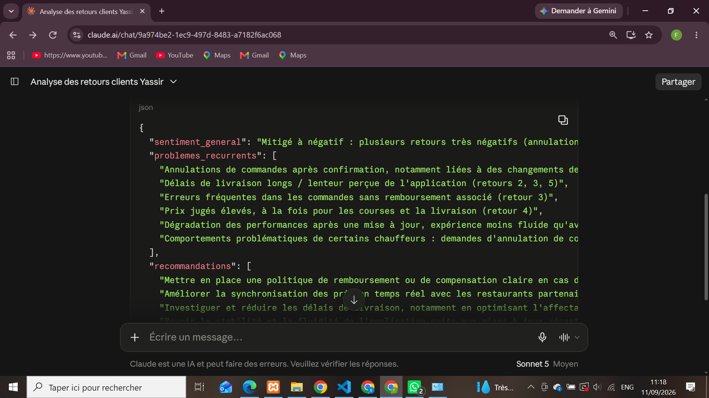
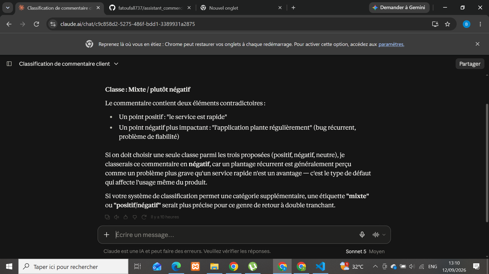
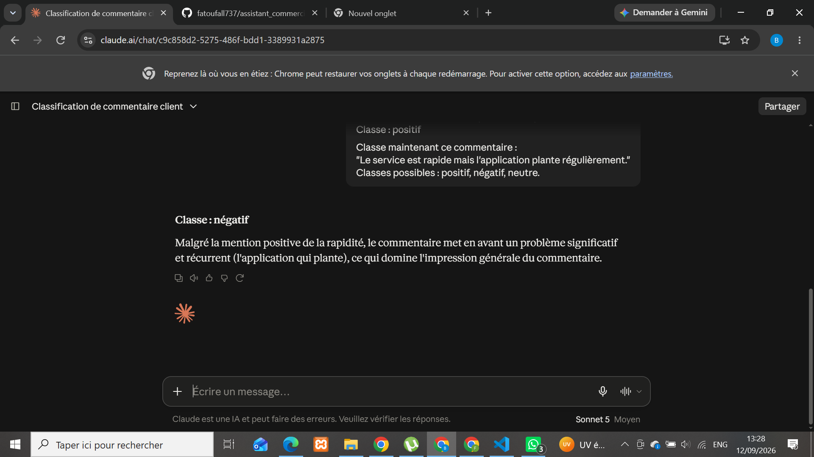
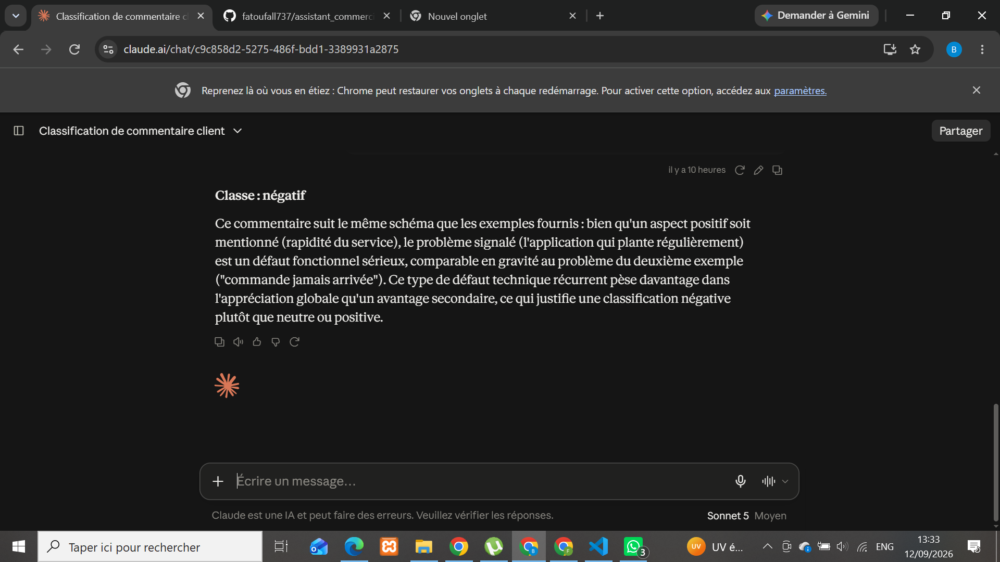
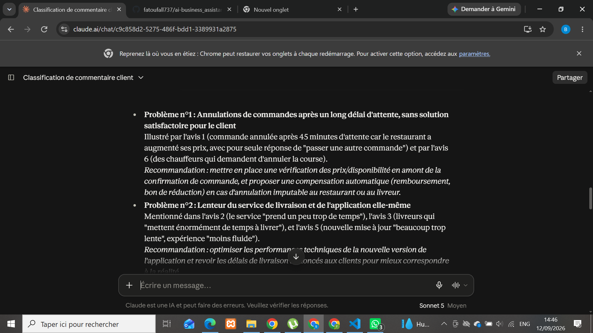
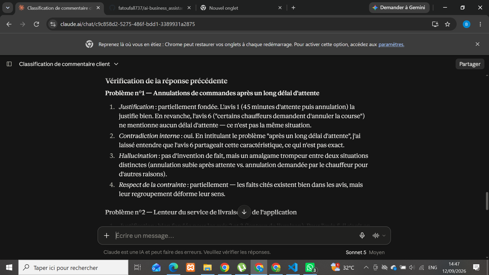
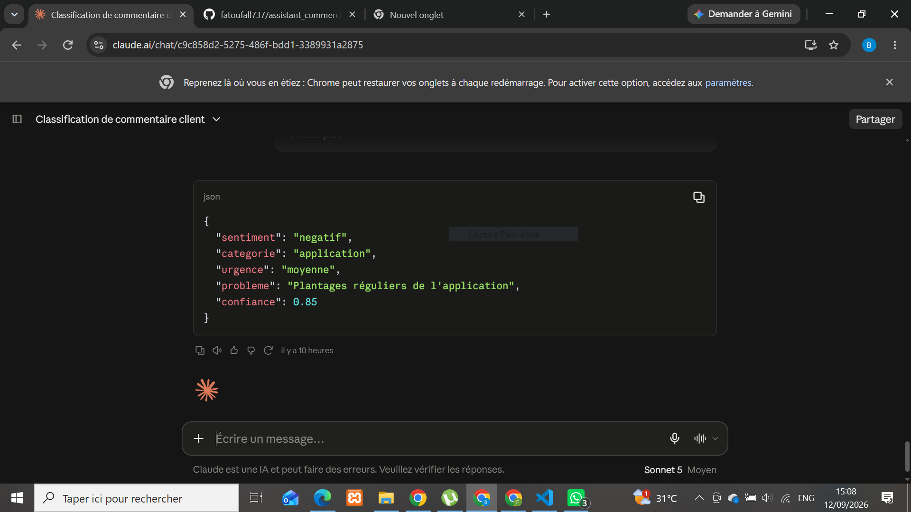
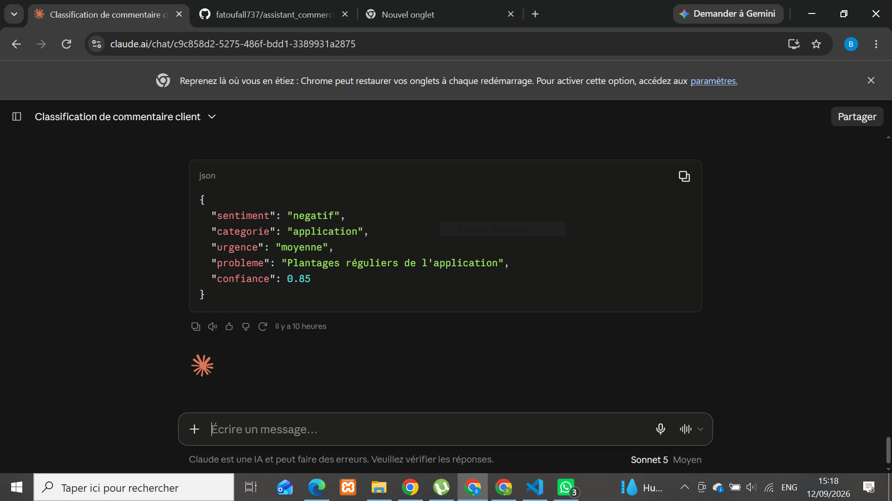
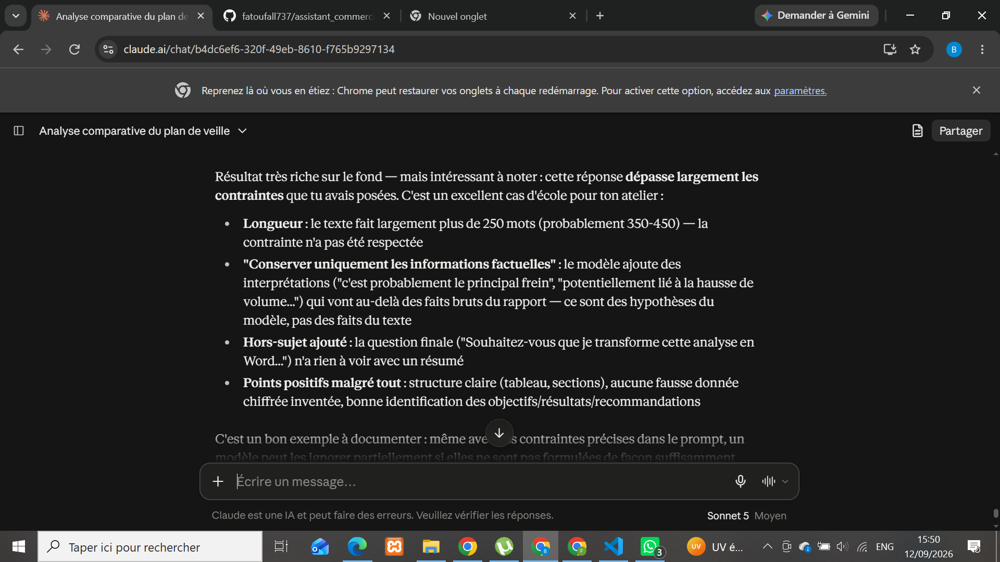
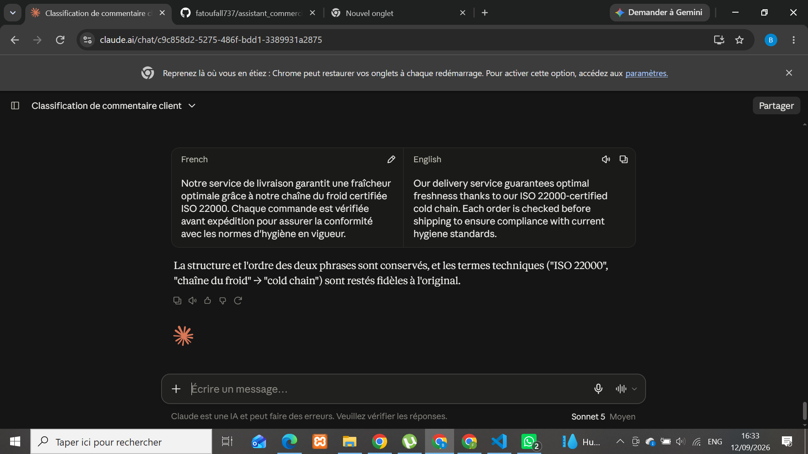

# ai-business_assistant

## Partie 1 – Anatomie d'un prompt

### Objectif

Construire un prompt permettant d'analyser les retours clients d'une entreprise, en identifiant clairement les composantes qui le structurent.

### Prompt utilisé

Tu es un analyste customer experience spécialisé dans l'analyse de retours clients.

Voici un ensemble de retours clients laissés par des utilisateurs de l'application Yassir :

"Très mauvaise expérience. J'ai confirmé ma commande par app, puis le livreur m'a appelé pour confirmer à nouveau. Après 45 minutes d'attente, on m'informe que la commande est annulée car le restaurant a augmenté ses prix. On me demande simplement de passer une autre commande. Service très décevant, je ne recommande absolument pas cette application."
"j'adore cette application pour acheter des trucs le problème c'est que ça prend un peu trop de temps donc il faut commander à l'avance. c'est vraiment très pratique donc je l'adore mais je pense à prendre un peu trop de temps mais merci"
"J'ai essayé d'utiliser cette app de livraison pendant 2 semaines, mais mon expérience a été très décevante. La majorité de mes commandes comportaient des erreurs, les livreurs mettent énormément de temps à livrer malgré l'erreur, vous ne bénéficiez d'aucun remboursement. Je déconseille donc fortement cette app."
"C'est une super appli, mais les prix des courses sont un peu élevés. J'espère qu'ils les baisseront. La livraison est également chère ; j'espère qu'ils baisseront les prix."
"Franchement, je préfère largement l'ancienne version. La nouvelle mise à jour est beaucoup trop lente et l'expérience est moins fluide. J'espère que les prochaines mises à jour amélioreront les performances."
"L'application est super, mais certains chauffeurs demandent d'annuler la course et d'autres demandent d'ajouter un montant en plus du montant de la commission."

Analyse ces retours et identifie : le sentiment général, les problèmes les plus fréquemment mentionnés, et des recommandations d'amélioration.

Contraintes : n'invente aucune information absente des retours. Reste factuel. Si un retour est ambigu, ne le classe pas arbitrairement.

Réponds uniquement en JSON avec les champs suivants :
{
"sentiment_general": "...",
"problemes_recurrents": ["...", "..."],
"recommandations": ["...", "..."]
}

### Annotation – composantes du prompt

| Composante           | Contenu dans le prompt                                                                                                                           | Rôle                                                                |
| -------------------- | ------------------------------------------------------------------------------------------------------------------------------------------------ | ------------------------------------------------------------------- |
| **Rôle**             | "Tu es un analyste customer experience spécialisé dans l'analyse de retours clients."                                                            | Cadre l'identité et le niveau d'expertise attendu du modèle         |
| **Contexte**         | Les 6 avis clients réels de l'application Yassir                                                                                                 | Fournit la matière première à analyser                              |
| **Tâche**            | "Analyse ces retours et identifie : le sentiment général, les problèmes les plus fréquemment mentionnés, et des recommandations d'amélioration." | Définit précisément ce qui est attendu                              |
| **Contraintes**      | "N'invente aucune information absente des retours. Reste factuel. Si un retour est ambigu, ne le classe pas arbitrairement."                     | Limite les hallucinations et impose la prudence sur les cas ambigus |
| **Format de sortie** | JSON avec 3 champs nommés (`sentiment_general`, `problemes_recurrents`, `recommandations`)                                                       | Rend la réponse exploitable directement par une application         |

### Réponse obtenue

```json
{
  "sentiment_general": "Mitigé à négatif : plusieurs retours très négatifs (annulations, erreurs de commande, absence de remboursement, prix élevés), un retour neutre à positif sur la praticité malgré la lenteur, et un retour mitigé satisfait du service mais critique sur les pratiques de certains chauffeurs.",
  "problemes_recurrents": [
    "Annulations de commandes après confirmation, notamment liées à des changements de prix côté restaurant",
    "Délais de livraison longs / lenteur perçue de l'application",
    "Erreurs fréquentes dans les commandes sans remboursement associé",
    "Prix jugés élevés, à la fois pour les courses et la livraison",
    "Dégradation des performances après une mise à jour, expérience moins fluide qu'avant",
    "Comportements problématiques de certains chauffeurs : demandes d'annulation de course ou de suppléments"
  ],
  "recommandations": [
    "Mettre en place une politique de remboursement ou de compensation claire en cas d'erreur",
    "Améliorer la synchronisation des prix en temps réel avec les restaurants partenaires",
    "Investiguer et réduire les délais de livraison, notamment en optimisant l'affectation des livreurs",
    "Revoir la stabilité et la fluidité de l'application suite aux mises à jour récentes"
  ]
}
```

### Capture d'écran



### Remarque

Deux avis étaient explicitement mixtes (ex. un avis satisfait du service de trajets mais critique sur la livraison). Conformément à la contrainte donnée, ils n'ont pas été forcés dans une catégorie unique.

## Partie 2 – Comparer les techniques de prompting

### Tâche 1 : Zero-shot

**Prompt utilisé**
Classe le commentaire suivant : "Le service est rapide mais l'application plante régulièrement."
Classes possibles : positif, négatif, neutre.

**Réponse obtenue**
Classe : Mixte / plutôt négatif — le commentaire contient un point positif ("service rapide") et un point négatif plus impactant ("plantages réguliers"). Le modèle propose "négatif" par défaut mais suggère qu'une catégorie "mixte" serait plus précise pour ce type de retour à double tranchant.

**Capture d'écran**


**Observation**
Sans contrainte de format, le modèle ne se limite pas aux 3 classes demandées : il argumente, nuance sa réponse et propose même une catégorie supplémentaire ("mixte") non prévue dans la consigne. La réponse est pertinente sur le fond, mais peu exploitable telle quelle par un programme (pas de sortie unique et fixe).

### Tâche 2 : One-shot

**Prompt utilisé**

Voici un exemple :
Commentaire : "Livraison rapide et sans problème."
Classe : positif

Classe maintenant ce commentaire :
"Le service est rapide mais l'application plante régulièrement."
Classes possibles : positif, négatif, neutre.

**Réponse obtenue**
Classe : négatif — malgré la mention positive de la rapidité, le commentaire met en avant un problème significatif et récurrent (l'application qui plante), ce qui domine l'impression générale.

**Capture d'écran**


**Observation**
Avec un seul exemple fourni, le modèle se conforme immédiatement au format attendu : une classe unique parmi les 3 proposées, sans ajouter de catégorie supplémentaire comme en zero-shot. Un seul exemple a donc suffi à cadrer la sortie, même si le raisonnement reste bref.

### Tâche 3 : Few-shot

**Prompt utilisé**

Voici des exemples :
Commentaire : "Livraison rapide et sans problème." → positif
Commentaire : "Commande jamais arrivée, aucun remboursement." → négatif
Commentaire : "Application correcte, rien de spécial à signaler." → neutre

Classe maintenant ce commentaire :
"Le service est rapide mais l'application plante régulièrement."
Classes possibles : positif, négatif, neutre.

**Réponse obtenue**
Classe : négatif — le modèle compare explicitement ce commentaire au deuxième exemple fourni ("commande jamais arrivée"), jugeant le défaut technique récurrent plus impactant que l'avantage de rapidité mentionné.

**Capture d'écran**


**Observation**
Même classe qu'en one-shot ("négatif"), mais le raisonnement du modèle s'appuie ici explicitement sur les exemples fournis pour justifier son choix par analogie. Le few-shot ne change pas seulement la sortie attendue : il influence aussi le style de raisonnement, qui imite la logique de comparaison montrée dans les exemples.

### Tâche 4 : Prompt structuré

**Prompt utilisé**

Tu es un système de classification de commentaires clients.

Commentaire à classer : "Le service est rapide mais l'application plante régulièrement."

Classes possibles : positif, négatif, neutre.

Contraintes : si le commentaire contient à la fois un élément positif et négatif, choisis la classe qui reflète le sentiment dominant. Ne donne aucune explication.

Réponds uniquement au format JSON :
{
"classe": "...",
"justification": "..."
}

**Réponse obtenue**

```json
{
  "classe": "négatif",
  "justification": "Le plantage récurrent de l'application est un défaut dominant qui l'emporte sur la rapidité du service."
}
```

**Capture d'écran**


**Observation**
Le prompt structuré produit une sortie directement exploitable par un programme (JSON valide, un seul champ de classe), avec une justification concise imposée par la contrainte "ne donne aucune explication". C'est la seule des 4 techniques à garantir un format fixe et prévisible.

### Comparaison des 4 techniques

| Technique            | Classe obtenue         | Format de sortie                     | Exploitable par un programme ?        |
| -------------------- | ---------------------- | ------------------------------------ | ------------------------------------- |
| Zero-shot            | Mixte / plutôt négatif | Texte libre, argumenté               | Non — pas de classe unique            |
| One-shot             | Négatif                | Texte court                          | Difficilement — pas de structure fixe |
| Few-shot             | Négatif                | Texte avec raisonnement par analogie | Difficilement — pas de structure fixe |
| **Prompt structuré** | **Négatif**            | **JSON strict**                      | **Oui — directement**                 |

### Conclusion de la Partie 2

Plus le prompt est précis (exemples fournis, puis structure imposée), plus la réponse converge vers une classification claire et cohérente. Seul le prompt structuré garantit une sortie fiable et exploitable automatiquement, ce qui en fait le choix le plus adapté pour une intégration réelle dans une application.

## Partie 3 – Prompt Engineering et raisonnement

### Tâche 1 : Décomposition d'un prompt

**Prompt à décomposer**

Analyse ces avis clients et donne-moi les problèmes les plus importants ainsi que les recommandations.

**Analyse des composantes**

| Composante  | Présente ? | Détail                                                                            |
| ----------- | ---------- | --------------------------------------------------------------------------------- |
| Rôle        | Absent     | Aucune identité donnée au modèle                                                  |
| Contexte    | Absent     | "Ces avis clients" est mentionné mais jamais fourni — faille principale du prompt |
| Tâche       | Présente   | Claire sur le fond : identifier problèmes + recommandations                       |
| Contraintes | Absentes   | Aucune limite (nombre de problèmes, niveau de factualité...)                      |
| Format      | Absent     | Aucune indication sur la structure de sortie attendue                             |

**Constat**
Ce prompt donne une tâche claire mais omet de fournir la matière première (le contexte) et n'encadre pas la sortie. Envoyé tel quel, un LLM risque soit de répondre de façon générique, soit d'halluciner des avis imaginaires pour pouvoir répondre.

**Version corrigée**

Tu es un analyste customer experience.

Voici des avis clients : [COLLER LES AVIS ICI]

Analyse ces avis et identifie : les 3 problèmes les plus importants, ainsi qu'une recommandation pour chacun.

Contraintes : base-toi uniquement sur les avis fournis, n'invente aucune information absente.

Format : une liste à puces, avec pour chaque problème une recommandation associée.

### Tâche 2 : Analyse + auto-vérification

**Prompt A — Analyse initiale**

Tu es un analyste customer experience.

Voici des avis clients de l'application Yassir :
[les 6 avis Yassir de la Partie 1]

Analyse ces avis et identifie les 3 problèmes les plus importants ainsi qu'une recommandation pour chacun.

Contraintes : base-toi uniquement sur les avis fournis, n'invente aucune information absente.

Format : liste à puces.

**Réponse au Prompt A**

- Problème 1 : Annulations de commandes après un long délai d'attente (avis 1 et 6)
- Problème 2 : Lenteur du service de livraison et de l'application (avis 2, 3, 5)
- Problème 3 : Erreurs de commande sans remboursement, frais imposés par certains chauffeurs (avis 3 et 6)

**Capture d'écran**


**Prompt B — Auto-vérification**

Vérifie ta réponse précédente. Pour chaque problème et recommandation mentionné, indique :

S'il est bien justifié par les avis fournis (ou s'il s'agit d'une supposition non appuyée)
S'il y a des contradictions internes dans ta réponse
Si des informations utilisées ne figurent dans aucun des avis originaux (hallucination)
Si tu as bien respecté la contrainte de ne rien inventer

Corrige ta réponse si nécessaire.

**Réponse au Prompt B**
Aucune information inventée détectée, mais plusieurs faiblesses identifiées par le modèle lui-même :

- Le problème 1 mélangeait deux situations différentes (annulation après attente vs. annulation demandée par le chauffeur)
- Le problème 2 regroupait deux causes distinctes (lenteur de livraison vs. lenteur de l'application)
- L'avis 4 (prix élevés) n'avait été utilisé dans aucun des 3 problèmes de la réponse initiale

Une réponse corrigée a été proposée, avec des problèmes redéfinis plus précisément et l'avis 4 intégré.

**Capture d'écran**


**Observation**
Le second prompt (auto-vérification) a permis de détecter des faiblesses invisibles dans la première réponse : pas d'hallucination pure, mais des regroupements trompeurs et un avis complètement ignoré. Cela montre l'intérêt d'un prompt de contrôle systématique après une tâche d'analyse, même quand la première réponse semble déjà convaincante.

## Partie 4 – Sorties structurées

### Tâche 1 : Réponse au format JSON

**Prompt utilisé**

Analyse ce commentaire client : "Le service est rapide mais l'application plante régulièrement."

Extrais les informations suivantes et réponds uniquement en JSON avec les champs :

sentiment (chaîne de caractères, valeurs autorisées : "positif", "negatif", "neutre")
categorie (chaîne de caractères, ex : "livraison", "application", "prix", "service client"...)
urgence (chaîne de caractères, valeurs autorisées : "faible", "moyenne", "élevée")
probleme (chaîne de caractères, description courte du problème principal)
confiance (nombre décimal entre 0 et 1, ton niveau de certitude)

Exemple de résultat attendu :
{
"sentiment": "negatif",
"categorie": "livraison",
"urgence": "moyenne",
"probleme": "Retard de livraison",
"confiance": 0.91
}

**Réponse obtenue**

```json
{
  "sentiment": "negatif",
  "categorie": "application",
  "urgence": "moyenne",
  "probleme": "Plantages réguliers de l'application",
  "confiance": 0.85
}
```

**Capture d'écran**


**Observation**
Le modèle respecte parfaitement la structure demandée : JSON valide, les 5 champs présents, valeurs de `sentiment` et `urgence` conformes aux options autorisées, catégorie cohérente avec le problème identifié.

### Tâche 2 : Ajout des règles de validation

**Prompt utilisé**

Analyse ce commentaire client : "Le service est rapide mais l'application plante régulièrement."

Extrais les informations suivantes et réponds en JSON avec les champs :

sentiment
categorie
urgence
probleme
confiance

Règles de validation strictes à respecter :

Le JSON doit être valide (syntaxe correcte, guillemets doubles, pas de virgule finale)
Aucune propriété supplémentaire ne doit être ajoutée en dehors des 5 champs listés
"sentiment" doit obligatoirement valoir "positif", "negatif" ou "neutre" — aucune autre valeur n'est acceptée
"confiance" doit être un nombre décimal compris entre 0 et 1 (inclus)
"urgence" doit obligatoirement valoir "faible", "moyenne" ou "élevée" — aucune autre valeur n'est acceptée

Ne réponds qu'avec le JSON, sans texte avant ou après.

**Réponse obtenue**

```json
{
  "sentiment": "negatif",
  "categorie": "application",
  "urgence": "moyenne",
  "probleme": "Plantages réguliers de l'application",
  "confiance": 0.85
}
```

**Capture d'écran**


**Observation**
La réponse est identique à celle de la Tâche 1 : le modèle respectait déjà spontanément ces règles. L'intérêt des règles de validation explicites n'est donc pas visible ici, mais elles servent de garde-fou pour des cas plus ambigus ou pour garantir un comportement fiable et reproductible à grande échelle (traitement automatisé de nombreux commentaires, où une seule sortie mal formée peut casser un programme).

## Partie 5 – Prompts pour les applications métier

### Tâche 1 : Résumé de document

**Prompt utilisé**

Résume le texte suivant.

Contraintes :

Maximum 250 mots
Conserver uniquement les informations factuelles
Identifier clairement les objectifs
Identifier clairement les résultats
Identifier clairement les recommandations
N'invente aucune information absente du texte

Texte : [rapport d'activité trimestriel — Service Livraison T3 2026]

**Réponse obtenue**
[colle ici la réponse complète que Claude a donnée]

**Capture d'écran**


**Observation**
Malgré des contraintes précises dans le prompt, la réponse ne les respecte pas totalement :

- Longueur largement supérieure à 250 mots
- Ajout d'interprétations non factuelles ("c'est probablement le principal frein", "potentiellement lié à...") alors que la contrainte demandait de rester factuel
- Une question hors-sujet ajoutée à la fin ("Souhaitez-vous que je transforme cette analyse en Word ?")

Points positifs : structure claire (tableau), bonne identification des objectifs/résultats/recommandations, aucune donnée chiffrée inventée.

Ce résultat montre qu'une contrainte énoncée dans le prompt n'est pas toujours suffisante pour garantir un respect strict — une formulation plus impérative (ex : "ne réponds qu'avec le résumé, sans aucun texte additionnel, question ou proposition") serait nécessaire pour un usage réellement automatisé.

### Tâche 2 : Traduction

**Prompt utilisé**

Traduis le texte suivant du français vers l'anglais.

Contraintes :

Conserver le sens exact
Conserver la structure du texte (mêmes paragraphes, même ordre)
Conserver les termes techniques tels quels si nécessaire
Ne pas résumer
Ne rajoute aucune information absente du texte original

Texte : "Notre service de livraison garantit une fraîcheur optimale grâce à notre chaîne du froid certifiée ISO 22000. Chaque commande est vérifiée avant expédition pour assurer la conformité avec les normes d'hygiène en vigueur."

**Réponse obtenue**
"Our delivery service guarantees optimal freshness thanks to our ISO 22000-certified cold chain. Each order is checked before shipping to ensure compliance with current hygiene standards."

**Capture d'écran**


**Observation**
Contrairement à la Tâche 1 (résumé), toutes les contraintes ont été respectées ici : sens exact conservé, même structure (2 phrases, même ordre), terme technique "ISO 22000" conservé tel quel, rien de résumé ni ajouté. La tâche de traduction, plus mécanique, semble mieux se prêter au respect strict des contraintes qu'une tâche d'analyse/synthèse comme le résumé.
