# ai-business_assistant

## Partie 1 – Anatomie d'un prompt

### Objectif

Construire un prompt permettant d'analyser les retours clients d'une entreprise, en identifiant clairement les composantes qui le structurent.

### Prompt utilisé

Tu es un analyste customer experience spécialisé dans l'analyse de retours clients.

Voici un ensemble de retours clients laissés par des utilisateurs de l'application Yassir :

"Très mauvaise expérience. J'ai confirmé ma commande par app, puis le livreur m'a appelé pour confirmer à nouveau. Après 45 minutes d'attente, on m'informe que la commande est annulée car le restaurant a augmenté ses prix. On me demande simplement de passer une autre commande. Service très décevant, je ne recommande absolument pas cette application."
"j'adore cette application pour acheter des trucs le problème c'est que ça prend un peu trop de temps donc il faut commander à l'avance. c'est vraiment très pratique donc je l'adore mais je pense à prendre un peu trop de temps mais merci"
"J'ai essayé d'utiliser cette app de livraison pendant 2 semaines, mais mon expérience a été très décevante. La majorité de mes commandes comportaient des erreurs, les livreurs mettent énormément de temps à livrer malgré l'erreur, vous ne bénéficiez d'aucun remboursement. Je déconseille donc fortement cette app."
"C'est une super appli, mais les prix des courses sont un peu élevés. J'espère qu'ils les baisseront. La livraison est également chère ; j'espère qu'ils baisseront les prix."
"Franchement, je préfère largement l'ancienne version. La nouvelle mise à jour est beaucoup trop lente et l'expérience est moins fluide. J'espère que les prochaines mises à jour amélioreront les performances."
"L'application est super, mais certains chauffeurs demandent d'annuler la course et d'autres demandent d'ajouter un montant en plus du montant de la commission."

Analyse ces retours et identifie : le sentiment général, les problèmes les plus fréquemment mentionnés, et des recommandations d'amélioration.

Contraintes : n'invente aucune information absente des retours. Reste factuel. Si un retour est ambigu, ne le classe pas arbitrairement.

Réponds uniquement en JSON avec les champs suivants :
{
"sentiment_general": "...",
"problemes_recurrents": ["...", "..."],
"recommandations": ["...", "..."]
}

### Annotation – composantes du prompt

| Composante           | Contenu dans le prompt                                                                                                                           | Rôle                                                                |
| -------------------- | ------------------------------------------------------------------------------------------------------------------------------------------------ | ------------------------------------------------------------------- |
| **Rôle**             | "Tu es un analyste customer experience spécialisé dans l'analyse de retours clients."                                                            | Cadre l'identité et le niveau d'expertise attendu du modèle         |
| **Contexte**         | Les 6 avis clients réels de l'application Yassir                                                                                                 | Fournit la matière première à analyser                              |
| **Tâche**            | "Analyse ces retours et identifie : le sentiment général, les problèmes les plus fréquemment mentionnés, et des recommandations d'amélioration." | Définit précisément ce qui est attendu                              |
| **Contraintes**      | "N'invente aucune information absente des retours. Reste factuel. Si un retour est ambigu, ne le classe pas arbitrairement."                     | Limite les hallucinations et impose la prudence sur les cas ambigus |
| **Format de sortie** | JSON avec 3 champs nommés (`sentiment_general`, `problemes_recurrents`, `recommandations`)                                                       | Rend la réponse exploitable directement par une application         |

### Réponse obtenue

```json
{
  "sentiment_general": "Mitigé à négatif : plusieurs retours très négatifs (annulations, erreurs de commande, absence de remboursement, prix élevés), un retour neutre à positif sur la praticité malgré la lenteur, et un retour mitigé satisfait du service mais critique sur les pratiques de certains chauffeurs.",
  "problemes_recurrents": [
    "Annulations de commandes après confirmation, notamment liées à des changements de prix côté restaurant",
    "Délais de livraison longs / lenteur perçue de l'application",
    "Erreurs fréquentes dans les commandes sans remboursement associé",
    "Prix jugés élevés, à la fois pour les courses et la livraison",
    "Dégradation des performances après une mise à jour, expérience moins fluide qu'avant",
    "Comportements problématiques de certains chauffeurs : demandes d'annulation de course ou de suppléments"
  ],
  "recommandations": [
    "Mettre en place une politique de remboursement ou de compensation claire en cas d'erreur",
    "Améliorer la synchronisation des prix en temps réel avec les restaurants partenaires",
    "Investiguer et réduire les délais de livraison, notamment en optimisant l'affectation des livreurs",
    "Revoir la stabilité et la fluidité de l'application suite aux mises à jour récentes"
  ]
}
```

### Capture d'écran


### Remarque

Deux avis étaient explicitement mixtes (ex. un avis satisfait du service de trajets mais critique sur la livraison). Conformément à la contrainte donnée, ils n'ont pas été forcés dans une catégorie unique.

## Partie 2 – Comparer les techniques de prompting

### Tâche 1 : Zero-shot

**Prompt utilisé**
Classe le commentaire suivant : "Le service est rapide mais l'application plante régulièrement."
Classes possibles : positif, négatif, neutre.

**Réponse obtenue**
Classe : Mixte / plutôt négatif — le commentaire contient un point positif ("service rapide") et un point négatif plus impactant ("plantages réguliers"). Le modèle propose "négatif" par défaut mais suggère qu'une catégorie "mixte" serait plus précise pour ce type de retour à double tranchant.

**Capture d'écran**


**Observation**
Sans contrainte de format, le modèle ne se limite pas aux 3 classes demandées : il argumente, nuance sa réponse et propose même une catégorie supplémentaire ("mixte") non prévue dans la consigne. La réponse est pertinente sur le fond, mais peu exploitable telle quelle par un programme (pas de sortie unique et fixe).

### Tâche 2 : One-shot

**Prompt utilisé**

Voici un exemple :
Commentaire : "Livraison rapide et sans problème."
Classe : positif

Classe maintenant ce commentaire :
"Le service est rapide mais l'application plante régulièrement."
Classes possibles : positif, négatif, neutre.

**Réponse obtenue**
Classe : négatif — malgré la mention positive de la rapidité, le commentaire met en avant un problème significatif et récurrent (l'application qui plante), ce qui domine l'impression générale.

**Capture d'écran**


**Observation**
Avec un seul exemple fourni, le modèle se conforme immédiatement au format attendu : une classe unique parmi les 3 proposées, sans ajouter de catégorie supplémentaire comme en zero-shot. Un seul exemple a donc suffi à cadrer la sortie, même si le raisonnement reste bref.

### Tâche 3 : Few-shot

**Prompt utilisé**

Voici des exemples :
Commentaire : "Livraison rapide et sans problème." → positif
Commentaire : "Commande jamais arrivée, aucun remboursement." → négatif
Commentaire : "Application correcte, rien de spécial à signaler." → neutre

Classe maintenant ce commentaire :
"Le service est rapide mais l'application plante régulièrement."
Classes possibles : positif, négatif, neutre.

**Réponse obtenue**
Classe : négatif — le modèle compare explicitement ce commentaire au deuxième exemple fourni ("commande jamais arrivée"), jugeant le défaut technique récurrent plus impactant que l'avantage de rapidité mentionné.

**Capture d'écran**


**Observation**
Même classe qu'en one-shot ("négatif"), mais le raisonnement du modèle s'appuie ici explicitement sur les exemples fournis pour justifier son choix par analogie. Le few-shot ne change pas seulement la sortie attendue : il influence aussi le style de raisonnement, qui imite la logique de comparaison montrée dans les exemples.

### Tâche 4 : Prompt structuré

**Prompt utilisé**

Tu es un système de classification de commentaires clients.

Commentaire à classer : "Le service est rapide mais l'application plante régulièrement."

Classes possibles : positif, négatif, neutre.

Contraintes : si le commentaire contient à la fois un élément positif et négatif, choisis la classe qui reflète le sentiment dominant. Ne donne aucune explication.

Réponds uniquement au format JSON :
{
"classe": "...",
"justification": "..."
}

**Réponse obtenue**

```json
{
  "classe": "négatif",
  "justification": "Le plantage récurrent de l'application est un défaut dominant qui l'emporte sur la rapidité du service."
}
```

**Capture d'écran**


**Observation**
Le prompt structuré produit une sortie directement exploitable par un programme (JSON valide, un seul champ de classe), avec une justification concise imposée par la contrainte "ne donne aucune explication". C'est la seule des 4 techniques à garantir un format fixe et prévisible.

### Comparaison des 4 techniques

| Technique            | Classe obtenue         | Format de sortie                     | Exploitable par un programme ?        |
| -------------------- | ---------------------- | ------------------------------------ | ------------------------------------- |
| Zero-shot            | Mixte / plutôt négatif | Texte libre, argumenté               | Non — pas de classe unique            |
| One-shot             | Négatif                | Texte court                          | Difficilement — pas de structure fixe |
| Few-shot             | Négatif                | Texte avec raisonnement par analogie | Difficilement — pas de structure fixe |
| **Prompt structuré** | **Négatif**            | **JSON strict**                      | **Oui — directement**                 |

### Conclusion de la Partie 2

Plus le prompt est précis (exemples fournis, puis structure imposée), plus la réponse converge vers une classification claire et cohérente. Seul le prompt structuré garantit une sortie fiable et exploitable automatiquement, ce qui en fait le choix le plus adapté pour une intégration réelle dans une application.

## Partie 3 – Prompt Engineering et raisonnement

### Tâche 1 : Décomposition d'un prompt

**Prompt à décomposer**

Analyse ces avis clients et donne-moi les problèmes les plus importants ainsi que les recommandations.

**Analyse des composantes**

| Composante  | Présente ? | Détail                                                                            |
| ----------- | ---------- | --------------------------------------------------------------------------------- |
| Rôle        | Absent     | Aucune identité donnée au modèle                                                  |
| Contexte    | Absent     | "Ces avis clients" est mentionné mais jamais fourni — faille principale du prompt |
| Tâche       | Présente   | Claire sur le fond : identifier problèmes + recommandations                       |
| Contraintes | Absentes   | Aucune limite (nombre de problèmes, niveau de factualité...)                      |
| Format      | Absent     | Aucune indication sur la structure de sortie attendue                             |

**Constat**
Ce prompt donne une tâche claire mais omet de fournir la matière première (le contexte) et n'encadre pas la sortie. Envoyé tel quel, un LLM risque soit de répondre de façon générique, soit d'halluciner des avis imaginaires pour pouvoir répondre.

**Version corrigée**

Tu es un analyste customer experience.

Voici des avis clients : [COLLER LES AVIS ICI]

Analyse ces avis et identifie : les 3 problèmes les plus importants, ainsi qu'une recommandation pour chacun.

Contraintes : base-toi uniquement sur les avis fournis, n'invente aucune information absente.

Format : une liste à puces, avec pour chaque problème une recommandation associée.

### Tâche 2 : Analyse + auto-vérification

**Prompt A — Analyse initiale**

Tu es un analyste customer experience.

Voici des avis clients de l'application Yassir :
[les 6 avis Yassir de la Partie 1]

Analyse ces avis et identifie les 3 problèmes les plus importants ainsi qu'une recommandation pour chacun.

Contraintes : base-toi uniquement sur les avis fournis, n'invente aucune information absente.

Format : liste à puces.

**Réponse au Prompt A**

- Problème 1 : Annulations de commandes après un long délai d'attente (avis 1 et 6)
- Problème 2 : Lenteur du service de livraison et de l'application (avis 2, 3, 5)
- Problème 3 : Erreurs de commande sans remboursement, frais imposés par certains chauffeurs (avis 3 et 6)

**Capture d'écran**


**Prompt B — Auto-vérification**

Vérifie ta réponse précédente. Pour chaque problème et recommandation mentionné, indique :

S'il est bien justifié par les avis fournis (ou s'il s'agit d'une supposition non appuyée)
S'il y a des contradictions internes dans ta réponse
Si des informations utilisées ne figurent dans aucun des avis originaux (hallucination)
Si tu as bien respecté la contrainte de ne rien inventer

Corrige ta réponse si nécessaire.

**Réponse au Prompt B**
Aucune information inventée détectée, mais plusieurs faiblesses identifiées par le modèle lui-même :

- Le problème 1 mélangeait deux situations différentes (annulation après attente vs. annulation demandée par le chauffeur)
- Le problème 2 regroupait deux causes distinctes (lenteur de livraison vs. lenteur de l'application)
- L'avis 4 (prix élevés) n'avait été utilisé dans aucun des 3 problèmes de la réponse initiale

Une réponse corrigée a été proposée, avec des problèmes redéfinis plus précisément et l'avis 4 intégré.

**Capture d'écran**


**Observation**
Le second prompt (auto-vérification) a permis de détecter des faiblesses invisibles dans la première réponse : pas d'hallucination pure, mais des regroupements trompeurs et un avis complètement ignoré. Cela montre l'intérêt d'un prompt de contrôle systématique après une tâche d'analyse, même quand la première réponse semble déjà convaincante.

## Partie 4 – Sorties structurées

### Tâche 1 : Réponse au format JSON

**Prompt utilisé**

Analyse ce commentaire client : "Le service est rapide mais l'application plante régulièrement."

Extrais les informations suivantes et réponds uniquement en JSON avec les champs :

sentiment (chaîne de caractères, valeurs autorisées : "positif", "negatif", "neutre")
categorie (chaîne de caractères, ex : "livraison", "application", "prix", "service client"...)
urgence (chaîne de caractères, valeurs autorisées : "faible", "moyenne", "élevée")
probleme (chaîne de caractères, description courte du problème principal)
confiance (nombre décimal entre 0 et 1, ton niveau de certitude)

Exemple de résultat attendu :
{
"sentiment": "negatif",
"categorie": "livraison",
"urgence": "moyenne",
"probleme": "Retard de livraison",
"confiance": 0.91
}

**Réponse obtenue**

```json
{
  "sentiment": "negatif",
  "categorie": "application",
  "urgence": "moyenne",
  "probleme": "Plantages réguliers de l'application",
  "confiance": 0.85
}
```

**Capture d'écran**


**Observation**
Le modèle respecte parfaitement la structure demandée : JSON valide, les 5 champs présents, valeurs de `sentiment` et `urgence` conformes aux options autorisées, catégorie cohérente avec le problème identifié.

### Tâche 2 : Ajout des règles de validation

**Prompt utilisé**

Analyse ce commentaire client : "Le service est rapide mais l'application plante régulièrement."

Extrais les informations suivantes et réponds en JSON avec les champs :

sentiment
categorie
urgence
probleme
confiance

Règles de validation strictes à respecter :

Le JSON doit être valide (syntaxe correcte, guillemets doubles, pas de virgule finale)
Aucune propriété supplémentaire ne doit être ajoutée en dehors des 5 champs listés
"sentiment" doit obligatoirement valoir "positif", "negatif" ou "neutre" — aucune autre valeur n'est acceptée
"confiance" doit être un nombre décimal compris entre 0 et 1 (inclus)
"urgence" doit obligatoirement valoir "faible", "moyenne" ou "élevée" — aucune autre valeur n'est acceptée

Ne réponds qu'avec le JSON, sans texte avant ou après.

**Réponse obtenue**

```json
{
  "sentiment": "negatif",
  "categorie": "application",
  "urgence": "moyenne",
  "probleme": "Plantages réguliers de l'application",
  "confiance": 0.85
}
```

**Capture d'écran**


**Observation**
La réponse est identique à celle de la Tâche 1 : le modèle respectait déjà spontanément ces règles. L'intérêt des règles de validation explicites n'est donc pas visible ici, mais elles servent de garde-fou pour des cas plus ambigus ou pour garantir un comportement fiable et reproductible à grande échelle (traitement automatisé de nombreux commentaires, où une seule sortie mal formée peut casser un programme).

## Partie 5 – Prompts pour les applications métier

### Tâche 1 : Résumé de document

**Prompt utilisé**

Résume le texte suivant.

Contraintes :

Maximum 250 mots
Conserver uniquement les informations factuelles
Identifier clairement les objectifs
Identifier clairement les résultats
Identifier clairement les recommandations
N'invente aucune information absente du texte

Texte : [rapport d'activité trimestriel — Service Livraison T3 2026]

**Réponse obtenue**
[colle ici la réponse complète que Claude a donnée]

**Capture d'écran**


**Observation**
Malgré des contraintes précises dans le prompt, la réponse ne les respecte pas totalement :

- Longueur largement supérieure à 250 mots
- Ajout d'interprétations non factuelles ("c'est probablement le principal frein", "potentiellement lié à...") alors que la contrainte demandait de rester factuel
- Une question hors-sujet ajoutée à la fin ("Souhaitez-vous que je transforme cette analyse en Word ?")

Points positifs : structure claire (tableau), bonne identification des objectifs/résultats/recommandations, aucune donnée chiffrée inventée.

Ce résultat montre qu'une contrainte énoncée dans le prompt n'est pas toujours suffisante pour garantir un respect strict — une formulation plus impérative (ex : "ne réponds qu'avec le résumé, sans aucun texte additionnel, question ou proposition") serait nécessaire pour un usage réellement automatisé.

### Tâche 2 : Traduction

**Prompt utilisé**

Traduis le texte suivant du français vers l'anglais.

Contraintes :

Conserver le sens exact
Conserver la structure du texte (mêmes paragraphes, même ordre)
Conserver les termes techniques tels quels si nécessaire
Ne pas résumer
Ne rajoute aucune information absente du texte original

Texte : "Notre service de livraison garantit une fraîcheur optimale grâce à notre chaîne du froid certifiée ISO 22000. Chaque commande est vérifiée avant expédition pour assurer la conformité avec les normes d'hygiène en vigueur."

**Réponse obtenue**
"Our delivery service guarantees optimal freshness thanks to our ISO 22000-certified cold chain. Each order is checked before shipping to ensure compliance with current hygiene standards."

**Capture d'écran**


**Observation**
Contrairement à la Tâche 1 (résumé), toutes les contraintes ont été respectées ici : sens exact conservé, même structure (2 phrases, même ordre), terme technique "ISO 22000" conservé tel quel, rien de résumé ni ajouté. La tâche de traduction, plus mécanique, semble mieux se prêter au respect strict des contraintes qu'une tâche d'analyse/synthèse comme le résumé.

### Tâche 3 : Classification de ticket informatique

**Prompt utilisé**

Classe le ticket informatique suivant dans l'une des catégories : réseau, logiciel, matériel, sécurité, accès, autre.

Ticket : "Depuis ce matin, je n'arrive plus à me connecter à mon compte, le mot de passe est refusé alors que je suis certain de le saisir correctement. Impossible d'accéder à mes fichiers."

Réponds uniquement au format JSON avec les champs :
{
"categorie": "...",
"justification": "..."
}

**Réponse obtenue**

```json
{
  "categorie": "accès",
  "justification": "Le problème concerne l'impossibilité de se connecter au compte malgré un mot de passe correct, ce qui empêche l'accès aux fichiers."
}
```

**Capture d'écran**
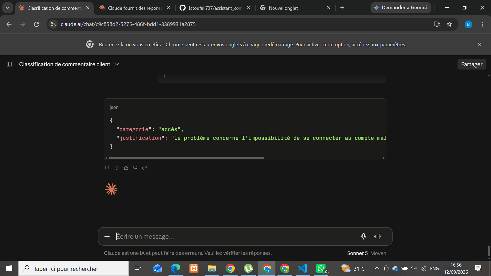

**Observation**
Classification cohérente : le modèle distingue bien un problème d'accès/authentification d'un problème de sécurité (qui aurait pu être une confusion possible, par exemple si le compte avait été piraté) ou d'un problème logiciel générique. JSON valide, catégorie choisie parmi la liste imposée.

### Tâche 4 : Extraction d'informations depuis une facture

**Prompt utilisé**

Extrais les informations suivantes de la facture ci-dessous. Réponds uniquement en JSON valide avec les champs :
{
"numero_facture": "...",
"date": "...",
"client": "...",
"montant_ht": ...,
"tva": ...,
"montant_ttc": ...
}

Si une information est absente du texte, mets la valeur null.

Facture :
"Facture n°FA-2026-0847
Date : 12/09/2026
Client : Entreprise Diallo & Fils
Montant HT : 150 000 FCFA
TVA (18%) : 27 000 FCFA
Montant TTC : 177 000 FCFA"

**Réponse obtenue**

```json
{
  "numero_facture": "FA-2026-0847",
  "date": "12/09/2026",
  "client": "Entreprise Diallo & Fils",
  "montant_ht": 150000,
  "tva": 27000,
  "montant_ttc": 177000
}
```

**Capture d'écran**
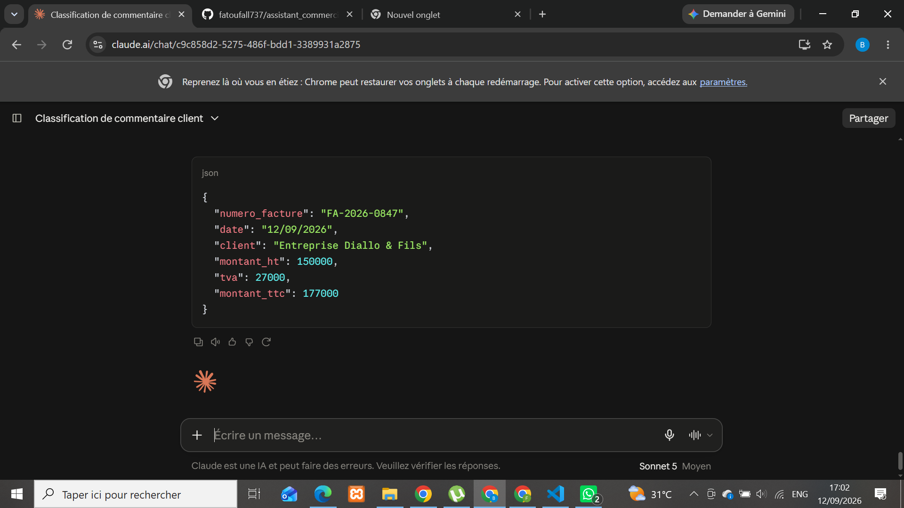

**Observation**
Les 6 champs sont correctement extraits et les montants sont convertis en nombres purs (sans "FCFA" ni espaces), ce qui les rend directement exploitables par un programme. Aucun champ absent ici, donc la règle du `null` n'a pas pu être testée dans ce cas — un test avec une facture incomplète permettrait de vérifier ce comportement.

### Tâche 5 : Email client (retard de livraison)

**Prompt utilisé**

Rédige un email destiné à un client dont la livraison a pris du retard.

Objectifs :

Reconnaître le retard
Présenter des excuses
Expliquer la situation sans inventer de cause précise
Proposer une solution

Ton : professionnel, courtois et rassurant.

Longueur maximale : 150 mots.

**Réponse obtenue**
Subject: Retard de votre livraison — nos excuses

Bonjour,

Nous vous contactons au sujet du retard survenu dans la livraison de votre commande. Nous en sommes sincèrement désolés et comprenons la gêne que cela a pu occasionner.

Ce retard est dû à un incident ponctuel dans notre chaîne logistique, actuellement en cours de résolution par nos équipes.

Afin de nous excuser pour ce désagrément, nous vous proposons [un geste commercial / un suivi prioritaire de votre commande / une remise sur votre prochaine commande]. N'hésitez pas à nous indiquer l'option que vous préférez.

Nous mettons tout en œuvre pour que votre commande vous parvienne dans les meilleurs délais et vous remercions sincèrement pour votre patience et votre confiance.

Cordialement,
L'équipe [Nom de l'entreprise]

**Capture d'écran**
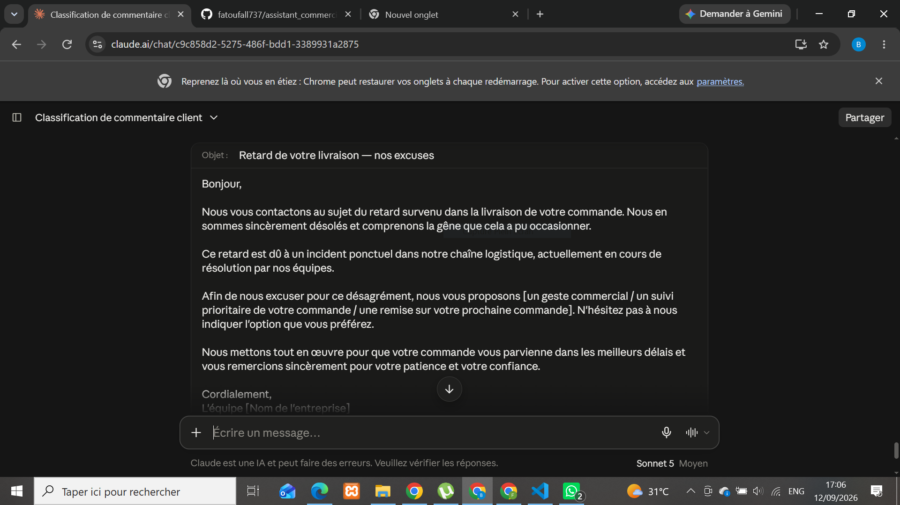

**Observation**
La plupart des objectifs sont respectés (reconnaissance du retard, excuses, solution proposée, ton adapté, longueur ~120 mots). Un écart notable cependant : la contrainte demandait explicitement de ne pas inventer de cause précise, mais le modèle propose quand même "un incident ponctuel dans notre chaîne logistique" — une explication plausible mais non fondée sur une information réelle. Cela illustre une tendance du modèle à combler les vides même quand on lui demande explicitement de ne pas le faire, si l'absence d'explication semble socialement ou commercialement inconfortable.

## Partie 6 – Prompt Engineering pour le Machine Learning

### Tâche 1 : Stratégies de traitement des données

**Prompt utilisé**

Tu es un data scientist expérimenté.

Contexte : Dataset de capteurs IoT, 605 lignes, colonnes : temperature (float), humidity (float), pressure (float), consumption (float), status (catégorielle : normal/alerte/critique).

Propose des stratégies pour traiter :

Les valeurs manquantes
Les doublons
Les valeurs aberrantes
Les variables catégorielles

Pour chaque point, indique : la méthode de détection, la méthode de traitement, et les risques associés à un mauvais traitement.

Format : une section par point, avec les 3 éléments demandés.

**Réponse obtenue (synthèse)**
Pour chacun des 4 axes (valeurs manquantes, doublons, outliers, variables catégorielles), le modèle propose : une méthode de détection avec code Python, une méthode de traitement adaptée au contexte IoT, et les risques d'un mauvais traitement. Point clé récurrent : ne jamais traiter une donnée isolément, mais toujours la croiser avec la variable `status`, car un "outlier" statistique peut en réalité correspondre à un vrai événement critique du capteur.

**Capture d'écran**
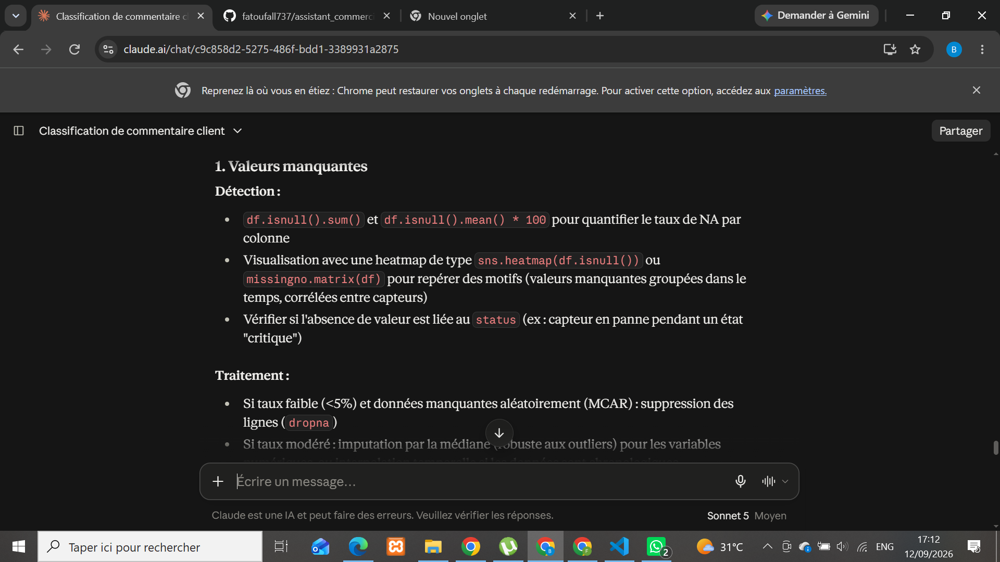

**Observation**
Réponse de très bon niveau technique : code Python concret et exploitable, raisonnement contextualisé au domaine IoT (distinction entre bruit de capteur et anomalie réelle), et mise en garde pertinente sur le déséquilibre des classes qui pourrait biaiser un futur modèle vers la classe majoritaire "normal" — un risque directement lié à ce qui avait été vu dans la veille sur les métriques de classification déséquilibrées.

### Tâche 2 : Visualisations pertinentes pour la consommation énergétique

**Prompt utilisé**

Tu es un data scientist expérimenté.

Contexte : Dataset de capteurs IoT, 605 lignes, colonnes : temperature (float), humidity (float), pressure (float), consumption (float), status (catégorielle : normal/alerte/critique).

Propose les visualisations les plus pertinentes pour comprendre la consommation énergétique d'un bâtiment (variable consumption).

Pour chaque visualisation, indique :

Le type de graphique
Les variables utilisées
L'objectif de la visualisation
L'interprétation attendue

Format : une section par visualisation proposée.

**Réponse obtenue**

1. **Histogramme / distribution de la consommation** — `sns.histplot(data=df, x='consumption', kde=True)` — objectif : identifier des régimes de fonctionnement distincts (multimodalité).
   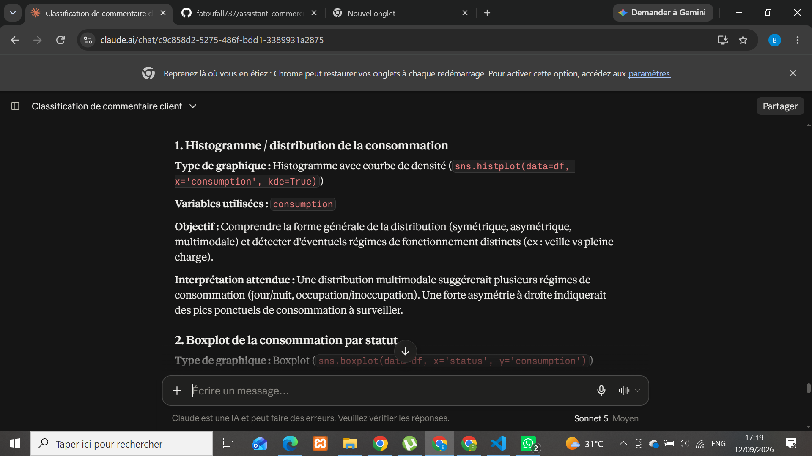

2. **Boxplot consommation par statut** — `sns.boxplot(data=df, x='status', y='consumption')` — objectif : vérifier si la surconsommation précède une dégradation du système.
   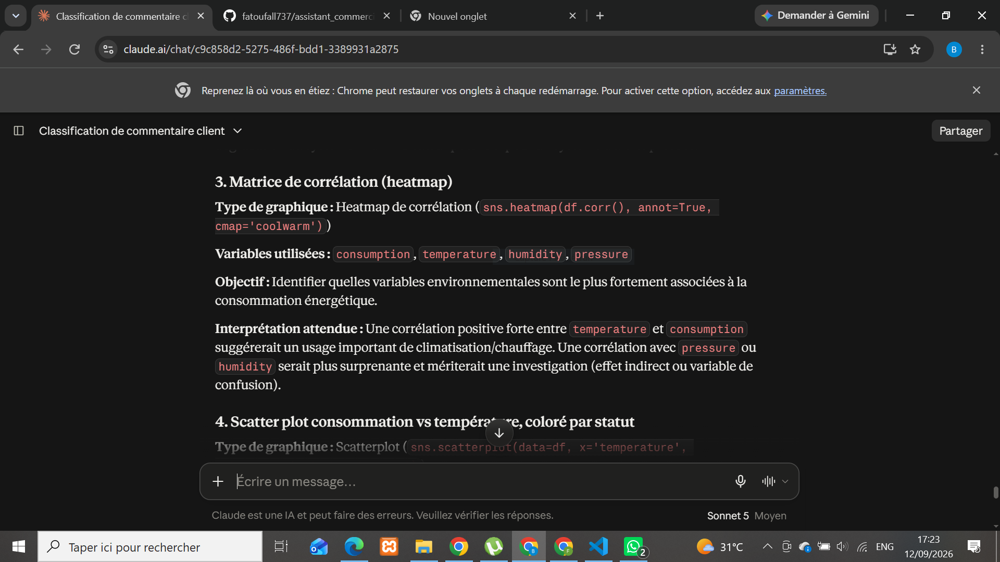

3. **Matrice de corrélation (heatmap)** — `sns.heatmap(df.corr(), annot=True, cmap='coolwarm')` — objectif : identifier les variables environnementales les plus corrélées à la consommation.
   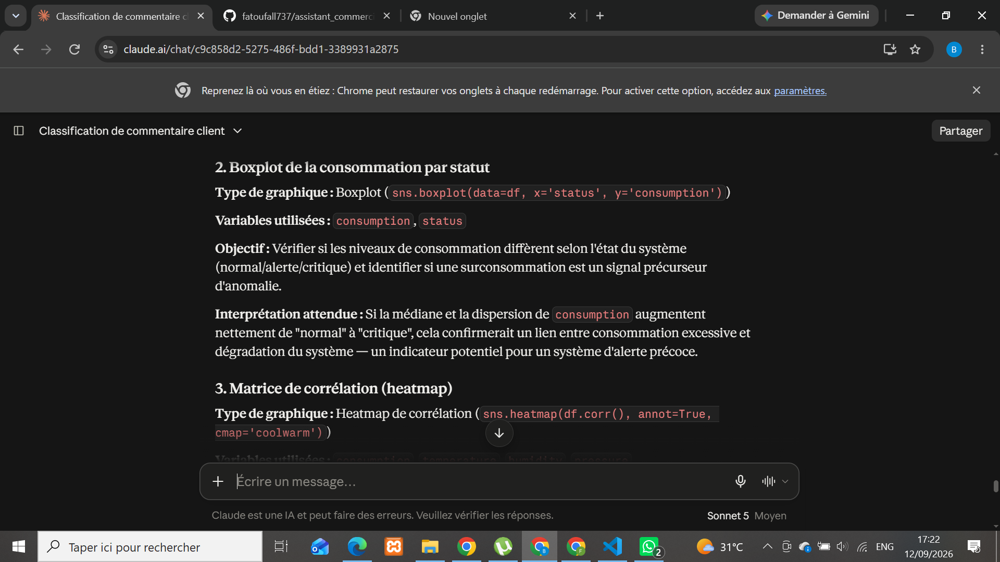

4. **Scatterplot température vs consommation, coloré par statut** — `sns.scatterplot(data=df, x='temperature', y='consumption', hue='status')` — objectif : localiser les points critiques dans l'espace température/consommation.
   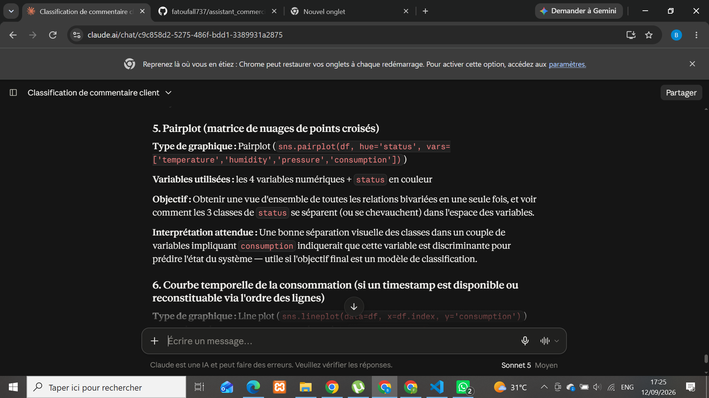

5. **Pairplot des 4 variables numériques, coloré par statut** — `sns.pairplot(df, hue='status', vars=[...])` — objectif : vue d'ensemble des relations bivariées et séparation des classes.
   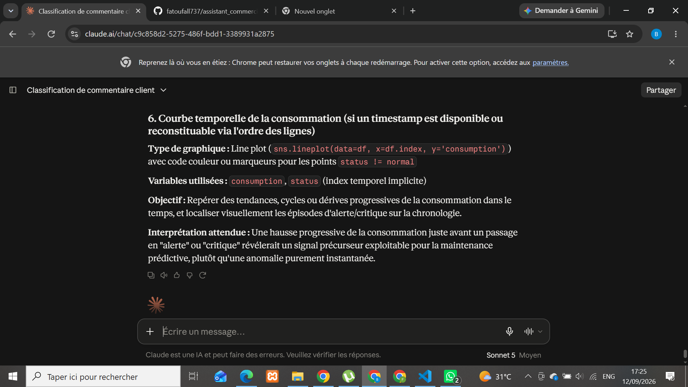

6. **Courbe temporelle de la consommation** — `sns.lineplot(data=df, x=df.index, y='consumption')` — objectif : détecter un signal précurseur avant un passage en alerte/critique (maintenance prédictive).
   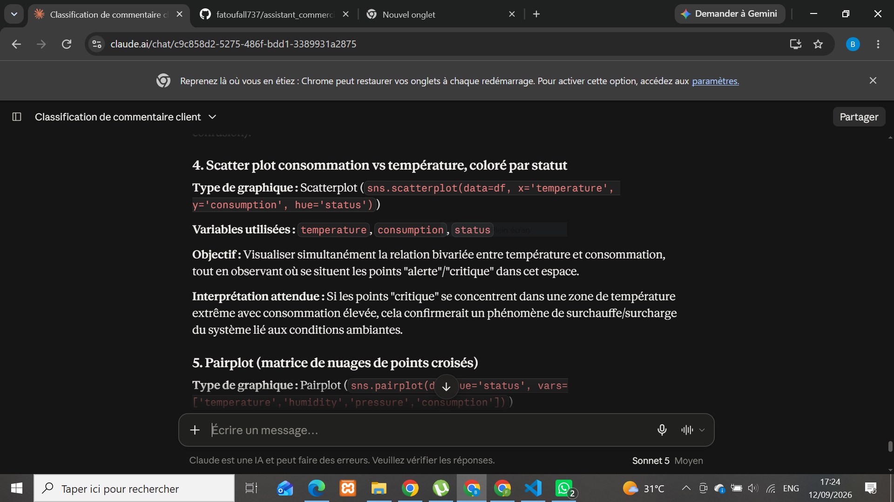

**Observation**
Les 6 visualisations proposées couvrent une progression logique : de l'analyse univariée (distribution) à l'analyse multivariée (pairplot), en passant par la relation avec la variable cible `status`. Le raisonnement métier est systématique (chaque graphique est justifié par une hypothèse exploitable, ex : maintenance prédictive, surchauffe), ce qui dépasse une simple liste technique de graphiques.

### Tâche 3 : Modèles adaptés à la prédiction de la consommation

**Prompt utilisé**

Tu es un expert en machine learning.

Contexte : Dataset de capteurs IoT, 605 lignes, colonnes : temperature (float), humidity (float), pressure (float), consumption (float), status (catégorielle : normal/alerte/critique).

Propose plusieurs modèles adaptés à la prédiction de la consommation énergétique d'un bâtiment (variable consumption, à prédire à partir des autres variables).

Pour chaque modèle, indique :

Le principe de fonctionnement
Les avantages
Les limites
Le type de problème concerné (régression, classification...)
Les métriques pertinentes pour l'évaluer

Format : une section par modèle proposé.

**Réponse obtenue (synthèse)**

| Modèle                               | Type       | Avantage clé                                          | Limite clé                                                             |
| ------------------------------------ | ---------- | ----------------------------------------------------- | ---------------------------------------------------------------------- |
| Régression linéaire multiple         | Régression | Interprétable, bonne baseline                         | Suppose une relation linéaire, sensible aux outliers                   |
| Random Forest Regressor              | Régression | Capture relations non linéaires, robuste aux outliers | Moins interprétable, risque d'overfitting sur 605 lignes               |
| Gradient Boosting (XGBoost/LightGBM) | Régression | Très performant sur données tabulaires                | Nombreux hyperparamètres, overfitting possible sans validation croisée |
| Support Vector Regression (SVR)      | Régression | Efficace même avec peu de données                     | Sensible aux hyperparamètres, nécessite normalisation                  |
| Réseau de neurones (MLP Regressor)   | Régression | Modélise des relations très complexes                 | Risque élevé d'overfitting sur un petit dataset, peu interprétable     |

Métriques communes recommandées : RMSE, MAE, R² (+ validation croisée pour tous les modèles, vu la taille limitée du dataset).

**Capture d'écran**
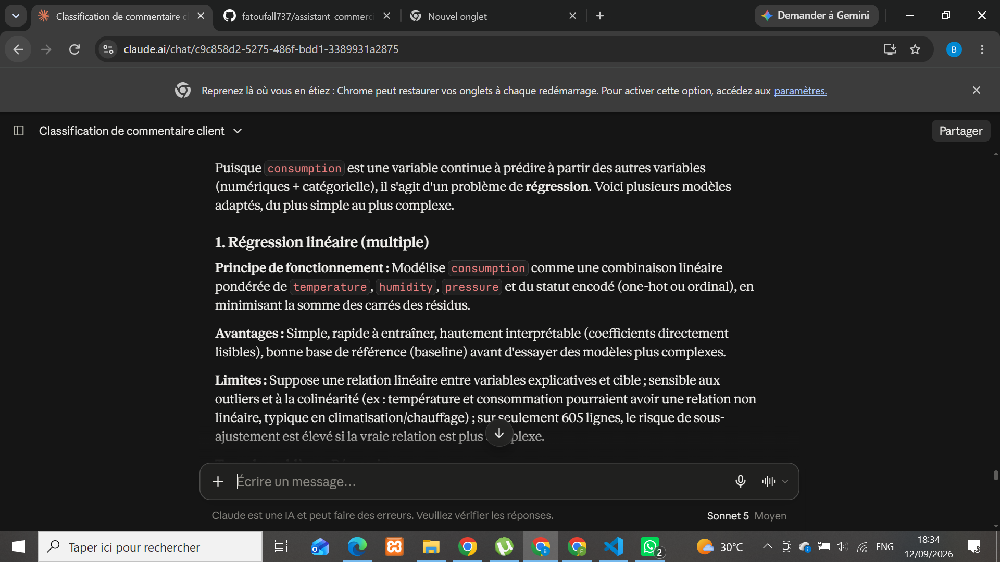
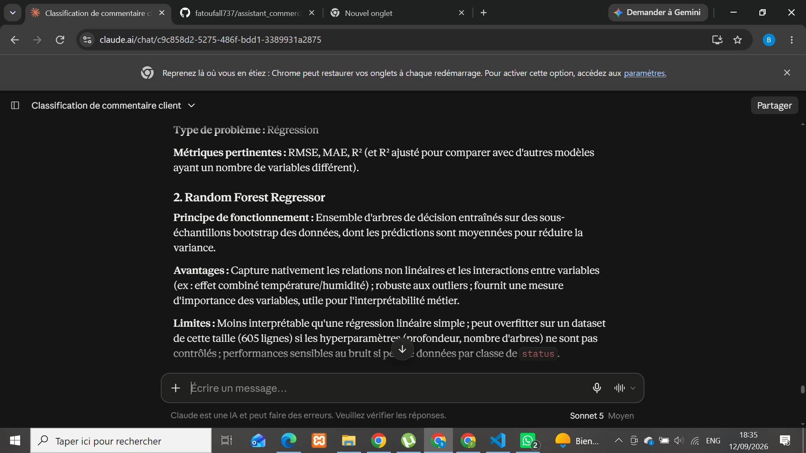

**Recommandation du modèle (donnée par Claude)**
Privilégier la régression linéaire comme baseline interprétable, puis comparer avec Random Forest ou Gradient Boosting (meilleur compromis performance/robustesse sur données tabulaires modestes), avec validation croisée systématique vu le faible volume de données (605 lignes).

**Observation**
Le modèle identifie correctement qu'il s'agit d'un problème de régression (variable cible continue) et adapte systématiquement son analyse à la contrainte réelle du dataset : sa petite taille (605 lignes) est mentionnée comme facteur de risque pour chaque modèle complexe proposé, ce qui montre une prise en compte fine du contexte plutôt qu'une réponse générique.

### Tâche 4 : Métriques de classification

**Prompt utilisé**

Tu es un expert en machine learning.

Explique les métriques de classification suivantes : Accuracy, Precision, Recall, F1-score, ROC-AUC.

Pour chaque métrique, indique :

La définition
Comment l'interpréter
Un exemple concret (par exemple appliqué à la détection d'un statut "critique" parmi normal/alerte/critique)
Dans quel contexte elle est particulièrement utile

Format : une section par métrique.

**Réponse obtenue (synthèse)**

| Métrique  | Définition                          | Utile quand...                                           |
| --------- | ----------------------------------- | -------------------------------------------------------- |
| Accuracy  | (VP+VN)/total                       | Classes équilibrées uniquement                           |
| Precision | VP/(VP+FP)                          | Le coût d'une fausse alerte est élevé                    |
| Recall    | VP/(VP+FN)                          | Rater un cas positif est plus grave qu'une fausse alerte |
| F1-score  | Moyenne harmonique precision/recall | Classes déséquilibrées, besoin d'une métrique unique     |
| ROC-AUC   | Aire sous la courbe ROC             | Comparer des modèles indépendamment du seuil             |

Chaque métrique a été illustrée avec le même exemple concret : détecter le statut "critique" (classe minoritaire) parmi normal/alerte/critique — ex : un modèle qui prédit toujours "normal" aurait une accuracy élevée (~95%) tout en étant inutile pour détecter les pannes.

**Capture d'écran**
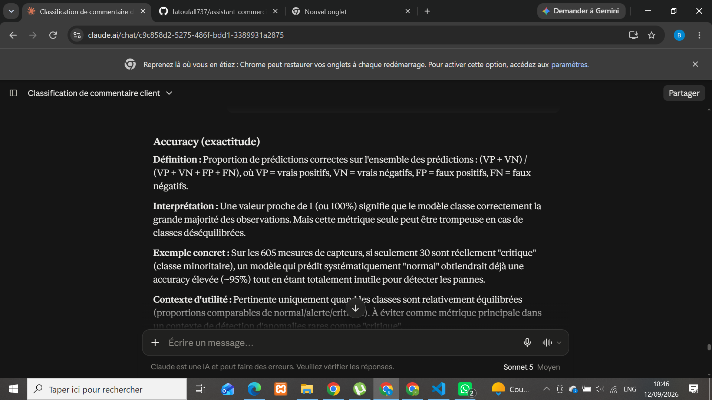
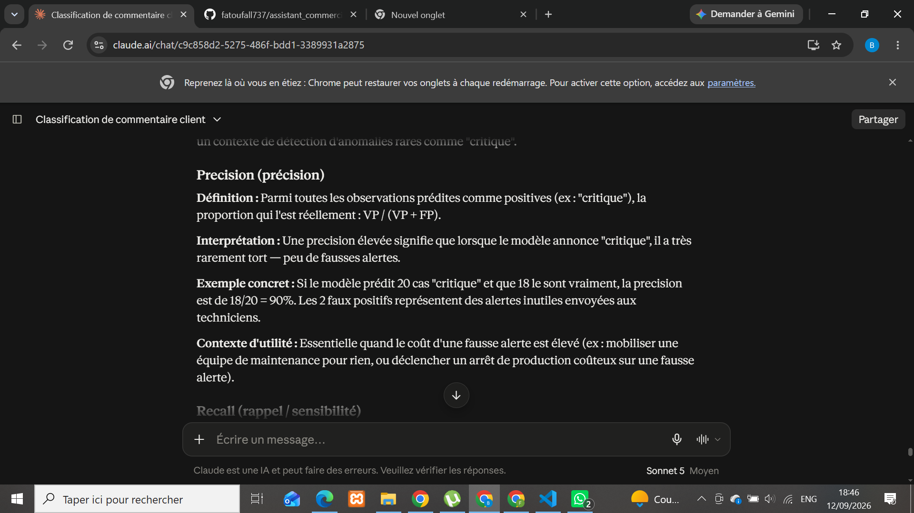


**Observation**
Le modèle relie systématiquement chaque métrique au même scénario concret (détection de "critique"), ce qui rend l'explication cohérente et applicable directement au dataset de l'atelier. Il ajoute même une nuance avancée non demandée (la courbe Precision-Recall comme alternative à l'AUC en cas de fort déséquilibre), ce qui dépasse une simple définition de cours.

### Tâche 5 : Métriques de régression

**Prompt utilisé**

Tu es un expert en machine learning.

Explique les métriques de régression suivantes : MAE, MSE, RMSE.

Pour chaque métrique, indique :

La définition
Comment l'interpréter
Un exemple concret (par exemple appliqué à la prédiction de la consommation énergétique en kWh)
Dans quel contexte elle est particulièrement utile

Format : une section par métrique.

**Réponse obtenue (synthèse)**

| Métrique | Définition                   | Sensible aux outliers ? | Utile quand...                                                                    |
| -------- | ---------------------------- | ----------------------- | --------------------------------------------------------------------------------- |
| MAE      | Moyenne des erreurs absolues | Non (robuste)           | Toutes les erreurs comptent également, interprétation simple                      |
| MSE      | Moyenne des erreurs au carré | Oui (fortement)         | Les grosses erreurs doivent être pénalisées, fonction de perte à l'entraînement   |
| RMSE     | Racine du MSE                | Oui                     | Comparer des modèles, détecter la présence d'outliers de prédiction (RMSE >> MAE) |

Exemple clé retenu : une RMSE de 8 kWh alors que la MAE est de 5 kWh indique que certaines prédictions s'écartent beaucoup plus que la moyenne (quelques pics de consommation mal anticipés).

**Capture d'écran**
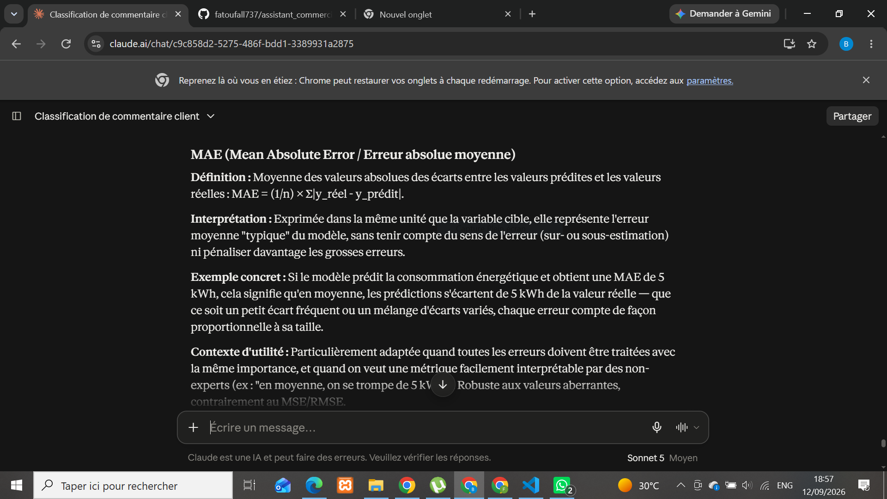
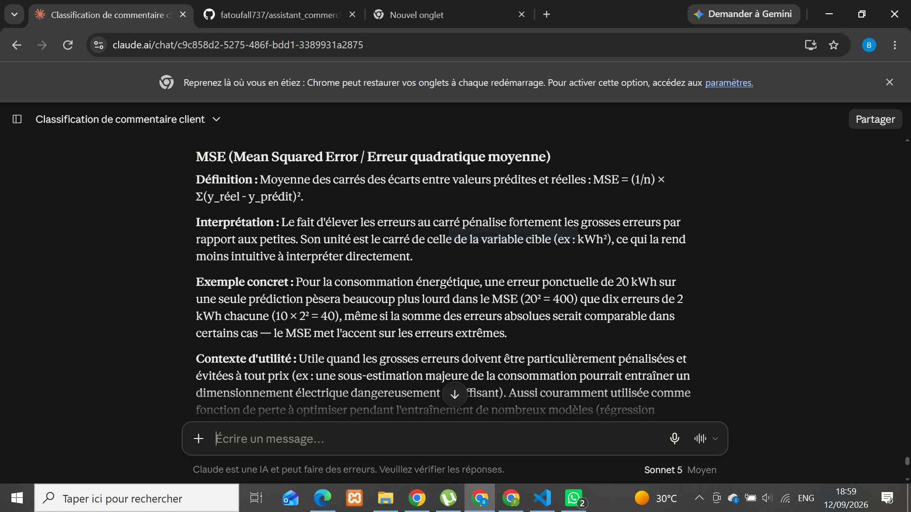
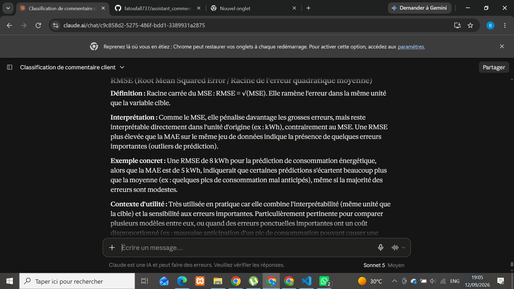

**Observation**
Le modèle explique clairement la relation entre RMSE et MAE comme indicateur indirect de la présence d'outliers (écart important entre les deux = quelques erreurs extrêmes), et relie systématiquement chaque métrique à un enjeu métier réel (dimensionnement électrique, risque de surcharge réseau) plutôt qu'à une simple définition mathématique abstraite.

## Partie 7 – Prompt Engineering et RAG

### Tâche 1 — Prompt A (sans document)

**Prompt testé**

Quel a été le taux d'annulation des commandes du service de livraison au 3e
trimestre 2026, et quelles actions ont été recommandées pour l'améliorer ?

**Réponse obtenue (synthèse)**

Le modèle indique ne pas avoir accès à un rapport spécifique sur ce sujet et refuse d'inventer un chiffre ou des recommandations précises. Il propose deux alternatives : recevoir le document en question, ou obtenir des informations générales et non chiffrées sur les causes typiques d'annulation dans les services de livraison.

**Capture d'écran**


**Observation**

Le modèle s'est correctement abstenu d'halluciner un taux d'annulation ou des recommandations spécifiques, malgré une question formulée de façon très précise (trimestre, année, métrique exacte) qui aurait pu l'inciter à "combler" le vide par une réponse plausible mais fausse. Il distingue clairement ce qu'il peut faire sans le document (généralités sectorielles) de ce qu'il ne peut pas faire (chiffres propres au rapport).

⚠️ **Point méthodologique** : un premier test de ce même prompt, mené dans une conversation ayant déjà accès à un autre rapport fictif (construit plus tôt dans l'atelier), avait produit des chiffres exacts alors qu'aucun document n'avait été fourni — en raison d'un accès implicite via l'historique de conversation / la fonctionnalité "Rechercher dans les conversations passées". Ce biais a été neutralisé pour ce test en réutilisant la conversation d'origine, distincte de celle contenant le rapport concerné par la question.

### Tâche 2 — Prompt B (avec document, sans contrainte)

**Document fourni**
Rapport interne "Service Livraison — 3e trimestre 2026" (reconstitution,
l'original ayant été créé dans une conversation antérieure non conservée) —
voir le rapport complet en annexe du fichier.

**Prompt testé**

Voici un rapport interne :
[rapport complet - voir annexe]

Quel a été le taux d'annulation des commandes du service de livraison au 3e
trimestre 2026, et quelles actions ont été recommandées pour l'améliorer ?

**Réponse obtenue (synthèse)**

Le modèle restitue correctement le taux d'annulation (6,1 % au T3 2026, contre 8,2 % au T2, toujours au-dessus de l'objectif de 5 %) et liste les trois actions recommandées, en les reliant explicitement aux causes d'annulation correspondantes (synchronisation des prix ↔ 42 % des annulations, renfort des effectifs ↔ 28 %, contrôle des frais additionnels des livreurs).

**Capture d'écran**


**Observation**

Le modèle a correctement extrait et restitué les informations du document, sans erreur ni invention. Il va même au-delà d'une simple restitution : il souligne de lui-même que la 3e cause d'annulation (erreurs/ruptures de stock, 18 %) n'est couverte par aucune action du plan — une observation critique pertinente, non demandée explicitement, qui montre une lecture analytique du document plutôt qu'un simple copier-coller d'information.

markdown

## Partie 7 – Prompt Engineering et RAG

Test de trois approches pour répondre à une question à partir d'un document :
sans document (A), avec document (B), avec document + contraintes (C).

**Document utilisé** : rapport interne fictif "Service Livraison — 3e trimestre
2026" (reconstitution, l'original ayant été créé dans une conversation
antérieure non conservée).

---

### Tâche 1 — Prompt A (sans document)

**Prompt testé**

Quel a été le taux d'annulation des commandes du service de livraison au 3e
trimestre 2026, et quelles actions ont été recommandées pour l'améliorer ?

**Réponse obtenue (synthèse)**

Le modèle indique ne pas avoir accès à un rapport spécifique sur ce sujet et refuse d'inventer un chiffre ou des recommandations précises. Il propose deux alternatives : recevoir le document, ou obtenir des informations générales et non chiffrées sur les causes typiques d'annulation dans les services de livraison.

**Capture d'écran**


**Observation**

Le modèle s'est correctement abstenu d'halluciner un taux d'annulation ou des recommandations spécifiques, malgré une question très précise (trimestre, année, métrique exacte) qui aurait pu l'inciter à "combler" le vide. Il distingue clairement les généralités sectorielles (qu'il peut fournir) des chiffres propres au rapport (qu'il ne peut pas connaître).

⚠️ **Point méthodologique** : un premier test de ce prompt, mené dans une conversation ayant déjà accès à un autre rapport fictif construit plus tôt dans l'atelier, avait produit des chiffres exacts alors qu'aucun document n'avait été fourni — en raison d'un accès implicite via l'historique de conversation. Ce biais a été neutralisé pour ce test.

---

### Tâche 2 — Prompt B (avec document, sans contrainte)

**Prompt testé**

Voici un rapport interne :
[rapport complet - voir annexe]

Quel a été le taux d'annulation des commandes du service de livraison au 3e
trimestre 2026, et quelles actions ont été recommandées pour l'améliorer ?

**Réponse obtenue (synthèse)**

Le modèle restitue correctement le taux d'annulation (6,1 % au T3 2026, contre 8,2 % au T2, au-dessus de l'objectif de 5 %) et liste les trois actions recommandées, en les reliant aux causes d'annulation correspondantes.

**Capture d'écran**


**Observation**

Réponse exacte et complète, sans erreur ni invention. Le modèle souligne de lui-même que la 3e cause d'annulation (ruptures de stock, 18 %) n'est couverte par aucune action du plan — une observation critique pertinente, non demandée, mais sans citation exacte du texte source.

---

### Tâche 3 — Prompt C (avec document + contraintes)

**Prompt testé**

[même rapport]

Quel a été le taux d'annulation des commandes du service de livraison au 3e
trimestre 2026, et quelles actions ont été recommandées pour l'améliorer ?

Contraintes :

Utilise uniquement les informations présentes dans le rapport ci-dessus.
N'invente aucune information absente du rapport.
Si une information n'est pas présente, indique-le clairement.
Cite le passage exact du rapport qui appuie ta réponse, si disponible.

**Question complémentaire testée**

Quel est le nom du responsable qui a rédigé ce rapport ?

**Réponse obtenue (synthèse)**

Pour la question principale, le modèle restitue le taux et les actions en citant systématiquement les passages exacts entre guillemets, et signale l'absence d'action sur la 3e cause. Pour la question complémentaire (info absente du rapport), il répond explicitement que l'information n'est pas présente, sans tenter de deviner.

**Capture d'écran**


**Observation**

Le respect des contraintes se voit dans la forme : chaque affirmation est appuyée par une citation exacte du rapport, contrairement au Prompt B (correct mais non sourcé passage par passage). Sur une question sans réponse dans le document, le modèle refuse catégoriquement d'inventer.

---

### Comparaison des résultats

| Critère                 | Prompt A (sans doc)          | Prompt B (avec doc) | Prompt C (avec doc + contraintes) |
| ----------------------- | ---------------------------- | ------------------- | --------------------------------- |
| Accès au document       | Non                          | Oui                 | Oui                               |
| Exactitude des chiffres | N/A (pas de chiffres donnés) | Exacte              | Exacte                            |
| Risque d'hallucination  | Faible (refus explicite)     | Faible              | Très faible                       |
| Signale l'info absente  | Oui (absence globale du doc) | Oui (spontané)      | Oui (systématique et demandé)     |
| Cite le passage source  | Non                          | Non                 | Oui, systématiquement             |

**Conclusion**

Les trois prompts ont donné des réponses honnêtes, sans hallucination majeure — y compris le Prompt A, qui aurait pu être le plus à risque. La vraie différence se situe dans la **traçabilité** : le Prompt C est le seul à ancrer chaque affirmation dans une citation exacte du document, ce qui rend la réponse vérifiable et réduit le risque d'erreur silencieuse. Fournir le document (B) améliore l'exactitude par rapport à A, mais c'est l'ajout de contraintes explicites (C) qui garantit la fiabilité et la vérifiabilité de la réponse — un point essentiel dans un contexte métier où les décisions s'appuient sur ces informations.

## Partie 8 – Évaluation et optimisation des prompts

Test de trois versions de prompt pour résumer un texte, puis évaluation comparative des réponses obtenues.

**Texte utilisé** : les 6 retours clients Yassir (mêmes avis que ceux analysés en début d'atelier).

---

### Tâche 1 — Prompt A (instruction minimale)

**Prompt testé**

Résume ce texte.

[6 retours clients Yassir - voir annexe]

**Réponse obtenue (synthèse)**

Le modèle produit un résumé structuré en deux blocs (points positifs / points négatifs récurrents), suivi d'une phrase de synthèse sur la tendance générale. Chaque point est associé au(x) numéro(s) d'avis correspondant(s). Longueur non contrôlée : le résumé est assez détaillé (liste de 6 points négatifs distincts).

**Capture d'écran**


**Observation**

Sans consigne de longueur ni de format, le modèle a spontanément choisi une structuration par thème (positif/négatif) plutôt qu'un résumé linéaire, et a même ajouté une phrase de synthèse interprétative non demandée ("tendance générale"). Le résultat est déjà exploitable, mais sa longueur et son niveau de détail dépendent entièrement du jugement du modèle, sans garantie de reproductibilité si le texte source était plus long.

markdown

### Tâche 2 — Prompt B (résumé en 150 mots)

**Prompt testé**

Résume ce texte en 150 mots.

[6 retours clients Yassir - voir annexe]

**Réponse obtenue (synthèse)**

Le modèle produit un résumé linéaire (paragraphe unique, pas de liste à puces), qui couvre les mêmes thèmes que le Prompt A mais de façon plus condensée et fluide, avec des transitions entre les points. Chaque affirmation reste associée au(x) numéro(s) d'avis correspondant(s). Le résumé se termine par une phrase de synthèse sur les axes d'amélioration attendus.

**Capture d'écran**


**Observation**

Le respect de la contrainte de longueur (~150 mots) a poussé le modèle vers un format différent de celui du Prompt A : plutôt qu'une liste par thème, il privilégie un texte continu, plus dense en information par mot mais moins facile à scanner rapidement qu'une liste à puces. La contrainte de longueur seule ne dit rien sur le format attendu (liste ? paragraphe ? public visé ?) — c'est un choix que le modèle a fait de lui-même, ce qui montre la limite d'un prompt qui ne spécifie qu'un seul paramètre.

### Tâche 3 — Prompt C (avec plus de composants de prompt)

**Prompt testé**

Tu es analyste customer experience.

Voici 6 retours clients laissés sur l'application Yassir :
[6 retours clients Yassir - voir annexe]

Rédige un résumé de ces retours destiné à l'équipe produit, en 150 mots maximum.
Le résumé doit :

Mentionner le sentiment général des utilisateurs
Regrouper les problèmes par thème plutôt que de lister chaque retour individuellement
Rester factuel, sans ajouter d'information absente des retours
Adopter un ton neutre et professionnel

**Réponse obtenue (synthèse)**

Le modèle produit un résumé structuré par thème avec des sous-titres explicites (Fiabilité des commandes, Délais de livraison, Tarification, Performance technique, Comportement des livreurs), précédé d'une phrase sur le sentiment général et suivi d'une conclusion sur les axes d'amélioration prioritaires. Le format respecte toutes les consignes du prompt : regroupement thématique, ton neutre, absence d'information inventée.

**Capture d'écran**


**Observation**

L'ajout de composants au prompt (rôle, destinataire, structure attendue, contraintes de fond) a produit un résultat nettement plus exploitable directement par une équipe produit : les sous-titres thématiques permettent une lecture rapide, et la contrainte "regrouper par thème" a été respectée à la lettre, contrairement au Prompt A et B où le regroupement thématique restait un choix du modèle plutôt qu'une consigne explicite. C'est le seul des trois prompts qui donne un contrôle réel sur la structure et l'audience du résumé, pas seulement sur sa longueur.

Et le tableau de comparaison finale pour la Partie 8 :

markdown

### Comparaison des résultats

| Critère                    | Prompt A                | Prompt B                     | Prompt C                                     |
| -------------------------- | ----------------------- | ---------------------------- | -------------------------------------------- |
| Contrôle de la longueur    | Aucun                   | Oui (150 mots)               | Oui (150 mots max)                           |
| Structuration par thème    | Choix du modèle (liste) | Choix du modèle (paragraphe) | Imposée et respectée (sous-titres)           |
| Ton / registre             | Neutre par défaut       | Neutre par défaut            | Neutre professionnel, conforme à la consigne |
| Audience définie           | Non                     | Non                          | Oui (équipe produit)                         |
| Reproductibilité du format | Faible                  | Faible                       | Élevée                                       |

**Conclusion**

Les trois prompts produisent des résumés fidèles au texte source, sans invention. La différence se joue sur le contrôle et la reproductibilité : le Prompt A laisse le modèle décider de tout (longueur, format, structure), le Prompt B ajoute un contrôle sur la longueur mais laisse le format libre, et le Prompt C — en précisant le rôle, l'audience, le format attendu et les contraintes de fond — est le seul à garantir un résultat prévisible et directement utilisable, peu importe le texte source fourni en entrée.
